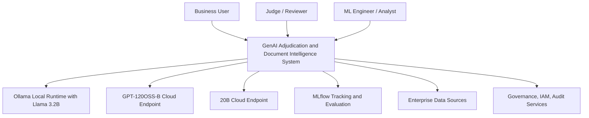
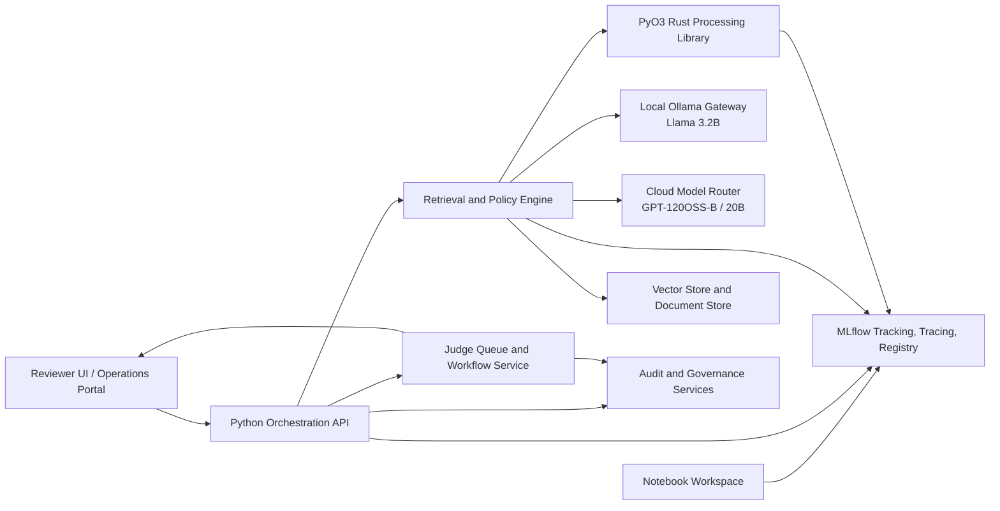
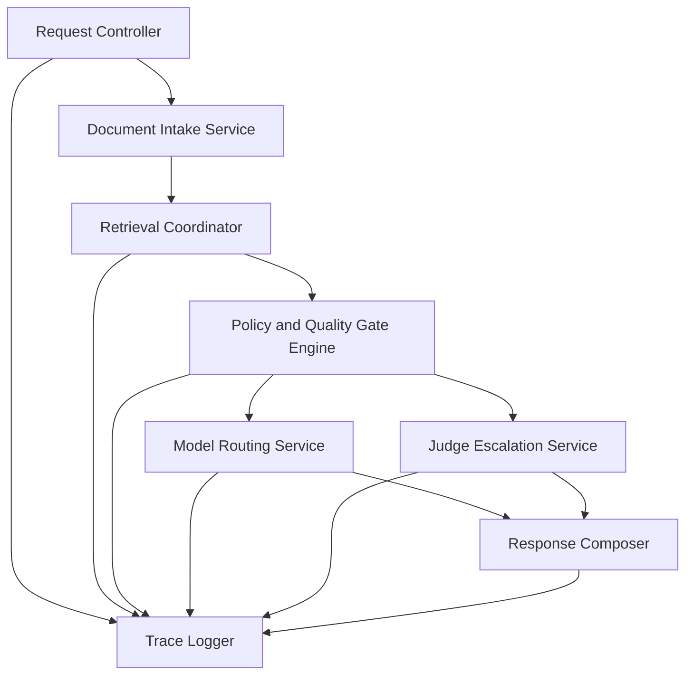
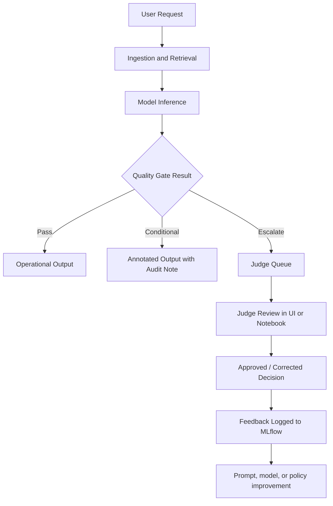

# Data-Quality-Review-System-GenAi

## Title
Data Quality Review System Gen Ai Prototype - Technology for Good
Work in Progress

## Scope
This document extends the previous architecture with C4 views, L1-L4 architecture depth, quality gates, human-in-the-loop judging, notebook-based monitoring, MLflow tracking, and model-routing across local and cloud inference paths.

## Architecture Statement

This architecture uses C4 and L1-L4 views to describe a governed generative AI workstream in which local Ollama-hosted Llama 3.2 handles private and low-cost tasks, cloud 20B and GPT-120OSS-B models handle harder reasoning, and MLflow plus notebook-based review provide the tracing, human feedback, and operational monitoring needed for trustworthy human-in-the-loop adjudication 

The workstream assumes:
- **Local model**: Llama 3.2B via Ollama for private, low-cost, low-latency tasks .
- **Cloud open-weight model path**: GPT-120OSS-B cloud endpoint for high-capacity reasoning workloads.
- **Cloud mid-tier model path**: 20B-class cloud model for balanced cost/performance workloads.
- **Tracking and evaluation**: MLflow/MLflow 3 for tracing, evaluation, and human feedback workflows
- **Human review**: judges and analysts review low-confidence, policy-sensitive, and contested outputs in notebook-led and operational review loops.

---

## Navigation

- [1. Architecture Principles](#1-architecture-principles)
- [2. Quality Gates](#2-quality-gates)
- [3. C4 Level 1](#3-c4-level-1--system-context)
- [4. C4 Level 2](#4-c4-level-2--container-view)
- [5. C4 Level 3](#5-c4-level-3--component-view)
- [6. C4 Level 4](#6-c4-level-4--code-and-implementation-view)
- [7. L1-L4 Architecture Stack](#7-l1-l4-architecture-stack)
- [8. Human-in-the-Loop Flow](#8-human-in-the-loop-flow)
- [9. Notebook and MLflow Monitoring](#9-notebook-and-mlflow-monitoring)
- [10. Model Routing Strategy](#10-model-routing-strategy)
- [11. Governance and Controls](#11-governance-and-controls)
- [12. Risks](#12-risks)

---

## 1. Architecture Principles

1. Keep **human review** in the loop for legal, regulatory, adjudication, and low-confidence decisions .
2. Use **MLflow tracing and feedback capture** to connect prompts, runs, outputs, and reviewer annotations into one governed lifecycle .
3. Route work to the **smallest effective model** first, escalating only when quality gates require it.
4. Keep sensitive work close to the edge with **local Ollama + Llama 3.2** where privacy, cost, or offline access matter .
5. Separate orchestration, inference, review, and governance into clean containers so the system remains auditable and evolvable .

---

## 2. Quality Gates

Quality gates decide whether a request can auto-complete, needs a stronger model, or must be reviewed by a human judge.

| Gate | Trigger | Action |
|---|---|---|
| G1 Input validation | Missing metadata, malformed file, unsupported schema | Reject or repair before inference |
| G2 Retrieval quality | Weak evidence set, poor chunk relevance, empty retrieval | Re-run retrieval or escalate model |
| G3 Model confidence | Low confidence, inconsistent reasoning, unsafe output | Send to judge queue |
| G4 Policy control | Sensitive category, regulated content, retention conflict | Mandatory human approval |
| G5 Judge disagreement | Two judges disagree or notebook review flags ambiguity | Escalate to senior reviewer |
| G6 Production drift | Quality trend falls in MLflow traces | Retrain, reprompt, or rollback |

### Gate Logic
- **Pass**: result can move to operational output.
- **Conditional pass**: result can proceed with audit note.
- **Escalate**: route to stronger model or human judge.
- **Fail**: block output and require remediation.

---

## 3. C4 Level 1 — System Context

C4 Level 1 shows the system in scope, the people around it, and the external services it interacts with .



### Context Statement
The system serves business users and judges, uses local and cloud models, records traces and feedback in MLflow, and integrates with enterprise data and governance services .

---

## 4. C4 Level 2 — Container View

C4 Level 2 breaks the system into applications and data stores, such as web apps, APIs, workers, notebooks, and registries.



### Container Notes
- The **Python orchestration API** coordinates workflow, model routing, and exception handling.
- The **Rust library via PyO3** handles performance-critical parsing and validation.
- **Notebook workspace** supports exploratory analysis, judge review experiments, and trace investigation, while **MLflow** records experiments, traces, prompts, outputs, and feedback .

---

## 5. C4 Level 3 — Component View

C4 Level 3 zooms into a single container and shows its internal components .

### Level 3 for the Python Orchestration API



### Component Responsibilities
| Component | Responsibility |
|---|---|
| Request Controller | Validates request and starts workflow |
| Document Intake Service | Normalises documents and metadata |
| Retrieval Coordinator | Gets evidence from indexed content |
| Policy and Quality Gate Engine | Applies safety, confidence, and workflow gates |
| Model Routing Service | Chooses local, 20B cloud, or GPT-120OSS-B cloud path |
| Judge Escalation Service | Sends cases to review queues and captures decision outcomes |
| Trace Logger | Sends prompts, traces, scores, and metadata to MLflow |
| Response Composer | Packages final answer, citations, confidence, and audit note |

---

## 6. C4 Level 4 — Code and Implementation View

C4 Level 4 is the code-level or implementation-level view of classes, modules, packages, or functions within a component.

### Example module structure

```text
src/
  api/
    controllers.py
    schemas.py
  services/
    intake_service.py
    retrieval_service.py
    routing_service.py
    judge_service.py
    policy_gate_service.py
    response_service.py
  adapters/
    ollama_client.py
    cloud_model_client.py
    mlflow_client.py
    vector_store_client.py
  rust_ext/
    parser.rs
    validator.rs
    chunker.rs
  notebooks/
    judge_review.ipynb
    drift_monitoring.ipynb
    prompt_eval.ipynb
```

### Pseudocode decision path

```python
if not input_is_valid(request):
    fail_gate("G1")

evidence = retrieve_context(request)
if evidence_is_weak(evidence):
    escalate_gate("G2")

model = choose_model(request, evidence, sensitivity=request.policy_class)
response = invoke_model(model, request, evidence)

scores = evaluate_response(response)
if violates_policy(scores):
    escalate_to_judge("G4")
elif low_confidence(scores):
    escalate_to_judge("G3")
else:
    publish_response(response)

log_trace_to_mlflow(request, evidence, model, response, scores)
```

### Rust extension concept

```rust
// PyO3 concept only
// fn validate_and_chunk(input: String) -> PyResult<Vec<String>>
```

The implementation view is where code packages align to the abstractions shown in C4 Level 3, which is the recommended intent of the model.

---

## 7. L1-L4 Architecture Stack

The document uses **two complementary hierarchies**.

| Layer | Meaning in this document | Main concern |
|---|---|---|
| L1 | Enterprise and business context | Who uses the system and why |
| L2 | Platform and container architecture | Major services and data stores |
| L3 | Application and component architecture | Internal service composition |
| L4 | Code, notebooks, prompts, and pipeline logic | Implementation and operations |

### L1 Enterprise View
- Judges, analysts, engineers, and business users operate within a regulated AI workstream.
- Governance, audit, identity, and data policies constrain system behaviour.

### L2 Platform View
- Python orchestration, retrieval engine, local Ollama runtime, cloud model router, MLflow, vector store, and governance services collaborate as platform containers.

### L3 Application View
- Routing, policy gates, retrieval, scoring, escalation, and trace logging form the application workflow core.

### L4 Implementation View
- Python modules, Rust crates, notebooks, evaluation scripts, prompt templates, and CI/CD controls deliver the working system.

---

## 8. Human-in-the-Loop Flow

Human-in-the-loop evaluation is important because real-world GenAI systems need human oversight and feedback loops, which MLflow 3 explicitly supports through annotations and feedback workflows.



### Judge Roles
- **Primary judge** reviews low-confidence or policy-sensitive cases.
- **Secondary judge** resolves contested cases.
- **Senior reviewer** handles precedent-setting or high-risk disagreements.

### Human Review Outputs
- approve,
- correct,
- reject,
- request more evidence,
- flag policy issue.

---

## 9. Notebook and MLflow Monitoring

MLflow supports GenAI tracing, evaluation, and human feedback workflows, while notebook-first patterns can be used to instrument traces, inspect runs, and analyse quality drift.

### Notebook Uses
- trace exploration,
- prompt comparison,
- judge agreement analysis,
- drift detection,
- retrieval quality inspection,
- latency and cost analysis.

### Monitored Metrics
| Metric | Meaning |
|---|---|
| Judge agreement rate | Consistency of human decisions |
| Low-confidence rate | Share of cases failing model confidence gate |
| Escalation rate | Percentage routed to human review |
| Retrieval hit quality | Evidence strength before generation |
| Latency by model tier | Local vs 20B cloud vs GPT-120OSS-B cloud |
| Cost per completed case | Operational efficiency of routing strategy |

### Notebook Governance Rule
Notebooks are not just for exploration. They act as supervised review surfaces for quality monitoring, replay, and adjudication analysis when connected to MLflow traces.

---

## 10. Model Routing Strategy

Ollama exposes local APIs for models such as Llama 3.2, which is positioned for multilingual dialogue, retrieval, and summarisation tasks. The architecture therefore routes simple and sensitive workloads locally first, then escalates when required.

| Route | Model path | Best use |
|---|---|---|
| R1 | Local Ollama + Llama 3.2B | Private summarisation, triage, first-pass classification |
| R2 | 20B cloud model | Balanced cost/performance reasoning |
| R3 | GPT-120OSS-B cloud | Hard reasoning, complex adjudication, fallback for difficult cases |

### Routing Policy
1. Try **local Llama 3.2B** for low-risk, low-complexity, or privacy-sensitive steps .
2. Escalate to **20B cloud** when the task needs stronger synthesis or longer-context reasoning.
3. Escalate to **GPT-120OSS-B cloud** when quality gates detect ambiguity, contested evidence, or repeated failure.
4. Send unresolved or policy-sensitive outputs to **human judges**.

### Ollama API pattern
```bash
curl http://localhost:11434/api/generate -d '{
  "model": "llama3.2",
  "prompt": "Summarise this document and identify any policy exceptions"
}'
```

This is consistent with documented Ollama local API usage and model invocation patterns.

---

## 11. Governance and Controls

### Core Controls
- identity and access management,
- prompt and model versioning,
- trace retention,
- judge accountability,
- model output audit,
- data classification and deletion controls,
- notebook access governance,
- release gates before production deployment.

### Review Controls
| Control | Purpose |
|---|---|
| Prompt registry | Prevent uncontrolled prompt drift |
| Experiment tracking | Compare model and prompt variants over time |
| Reviewer attribution | Record who approved or corrected a case |
| Escalation thresholds | Standardise when humans must review |
| Production tracing | Connect live incidents to reproducible evidence |

MLflow’s recent GenAI direction emphasizes tracing, evaluation, and feedback capture across the lifecycle, which aligns well with these governance needs.

---

## 12. Risks

| Risk | Consequence | Mitigation |
|---|---|---|
| Small local model underperforms | Missed nuance or weak reasoning | Escalation gates to 20B or GPT-120OSS-B |
| Cloud cost spikes | Budget pressure | Route-first strategy and cost telemetry |
| Judge inconsistency | Unstable decisions | Dual review and notebook agreement analysis |
| Notebook sprawl | Governance gaps | Controlled notebook workspaces and role-based access |
| Trace overload | Monitoring becomes noisy | Curated experiments and threshold-based alerting |
| Policy breach | Compliance exposure | Mandatory human approval for sensitive classes |

---

# References 
1.	https://ollama.com/library/llama3.2       
2.	https://www.mlflow.org/docs/3.2.0/genai/mlflow-3/           
3.	https://mlflow.org/docs/3.4.0rc0/genai/mlflow-3/    
4.	https://docs.azure.cn/en-us/databricks/mlflow3/genai/     
5.	https://docs.databricks.com/aws/en/mlflow3/genai/getting-started/human-feedback        
6.	https://www.infoq.com/articles/C4-architecture-model/      
7.	https://en.wikipedia.org/wiki/C4_model   
8.	https://docs.databricks.com/aws/en/mlflow3/genai/overview/  
9.	https://dev.to/lovestaco/making-sense-of-software-architecture-with-the-c4-model-1814  
10.	https://learn.microsoft.com/en-us/azure/databricks/mlflow3/genai/getting-started/tracing/tracing-notebook    
11.	https://docs.aws.amazon.com/sagemaker/latest/dg/mlflow.html 
12.	https://www.linkedin.com/posts/aksalinnisha03_localai-ollama-llama-activity-7329777902651170816-3qpI 
13.	https://www.datacamp.com/tutorial/run-llama-3-locally 
14.	https://mlflow.org/docs/latest/ml/ 
15.	https://ollama.com/library/llama3.2-vision 
